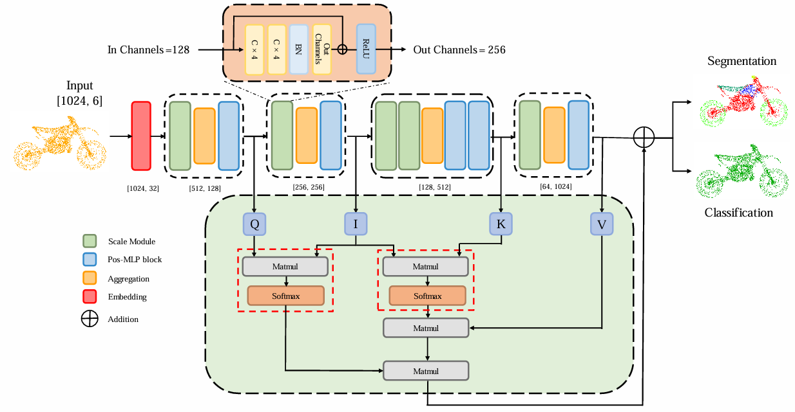

# Rethinking Network Design and Local Geometry in Point Cloud: A Simple Residual MLP Framework （ICLR 2022）


[](https://paperswithcode.com/sota/3d-point-cloud-classification-on-modelnet40?p=rethinking-network-design-and-local-geometry-1)
[](https://paperswithcode.com/sota/3d-point-cloud-classification-on-scanobjectnn?p=rethinking-network-design-and-local-geometry-1)


[](https://github.com/ma-xu/pointMLP-pytorch)


<div align="center">
  
</div>

Overall Architecture of LCHNet}. The bottom of the picture is the Intermediary-attention Mechanism proposed in this paper. The numbers below each basic module represent the output point count and channel number. The setting of the Scaling Residual Block is as shown at the top of this figure. In this network, the configuration of Pos-MLP Blocks is the same as that in the backbone network, PointMLP.


## Model Zoo

  **Questions on ModelNet40 classification results (a common issue for ModelNet40 dataset in the community)**
  
  The performance on ModelNet40 of almost all methods are not stable, see (https://github.com/CVMI-Lab/PAConv/issues/9#issuecomment-873371422).<br>
  If you run the same codes for several times, you will get different results (even with fixed seed).<br>
  The best way to reproduce the results is to test with a pretrained model for ModelNet40. <br>
  Also, the randomness of ModelNet40 is our motivation to experiment on ScanObjectNN, and to report the mean/std results of several runs.


------

## Install

```bash
# step 1. clone this repo
git clone https://github.com/DDYBGK/LCHNet.git
cd LCHNet

# step 2. create a conda virtual environment and activate it
conda env create
conda activate pointmlp
```

```bash
# Optional solution for step 2: install libs step by step
conda create -n pointmlp python=3.7 -y
conda activate pointmlp
conda install pytorch==1.10.1 torchvision==0.11.2 cudatoolkit=10.2 -c pytorch -y
# if you are using Ampere GPUs (e.g., A100 and 30X0), please install compatible Pytorch and CUDA versions, like:
# pip install torch==1.8.1+cu111 torchvision==0.9.1+cu111 torchaudio==0.8.1 -f https://download.pytorch.org/whl/torch_stable.html
pip install cycler einops h5py pyyaml==5.4.1 scikit-learn==0.24.2 scipy tqdm matplotlib==3.4.2
pip install pointnet2_ops_lib/.
```


## Useage

### Classification ModelNet40
**Train**: The dataset will be automatically downloaded, run following command to train.

By default, it will create a folder named "checkpoints/{modelName}-{msg}-{randomseed}", which includes args.txt, best_checkpoint.pth, last_checkpoint.pth, log.txt, out.txt.
```bash
cd classification_ModelNet40
# train pointMLP
python main.py --model pointMLP
# train pointMLP-elite
python main.py --model pointMLPElite
# please add other paramemters as you wish.
```


To conduct voting testing, run
```bash
# please modify the msg accrodingly
python voting.py --model pointMLP --msg demo
```


### Classification ScanObjectNN

The dataset will be automatically downloaded

- Train pointMLP/pointMLPElite 
```bash
cd classification_ScanObjectNN
# train pointMLP
python main.py --model pointMLP
# train pointMLP-elite
python main.py --model pointMLPElite
# please add other paramemters as you wish.
```
By default, it will create a fold named "checkpoints/{modelName}-{msg}-{randomseed}", which includes args.txt, best_checkpoint.pth, last_checkpoint.pth, log.txt, out.txt.


### Part segmentation

- Make data folder and download the dataset
```bash
cd part_segmentation
mkdir data
cd data
wget https://shapenet.cs.stanford.edu/media/shapenetcore_partanno_segmentation_benchmark_v0_normal.zip --no-check-certificate
unzip shapenetcore_partanno_segmentation_benchmark_v0_normal.zip
```

- Train pointMLP
```bash
# train pointMLP
python main.py --model pointMLP
# please add other paramemters as you wish.
```


## Acknowledgment

Our implementation is mainly based on the following codebases. We gratefully thank the authors for their wonderful works.

[Pointnet2_PyTorch](https://github.com/erikwijmans/Pointnet2_PyTorch)
[PointMLP](https://github.com/ma-xu/pointMLP-pytorch.git)
[PointStack](https://github.com/LongerVision/PointStack)

## LICENSE
LCHNet is under the Apache-2.0 license. 


